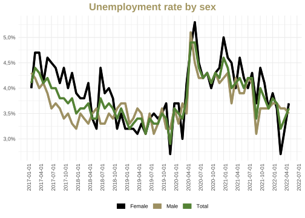

README
================

## User Manual

### Installation

To install the following package, please use:

``` r
devtools::install_github("makronomintezet/ggmacronom")
```

``` r
unemployment_df <- eurostat::get_eurostat("ei_lmhr_m")
```

``` r
p <- unemployment_df %>% 
  filter(s_adj == "SA" & indic %in% c("LM-UN-F-TOT", "LM-UN-M-TOT", "LM-UN-T-TOT"),
         geo == "HU", time > as.Date("2017-01-01")) %>% 
  mutate(
    indic = case_when(
      indic == "LM-UN-F-TOT" ~ "Female",
      indic == "LM-UN-M-TOT" ~ "Male",
      indic == "LM-UN-T-TOT" ~ "Total"
    )
  ) %>% 
  ggplot() + 
  aes(time, values, color = indic) + 
  geom_line() +
  labs(x = NULL, y = NULL, color = NULL, 
       title = "Unemployment rate by sex")

p
```


    ## Loading required package: sysfonts

    ## Loading required package: showtextdb

    ## Theme updated

``` r
p + theme_macronom()
```


``` r
p + 
  theme_macronom() + 
  scale_color_manual(values = macronom_colors(1:3))
```


### Some small manual fixes

``` r
p_pretty <- p + 
  geom_line(size = 1.7) +
  theme_macronom() + 
  scale_color_manual(values = macronom_colors(1:3)) + 
  scale_y_continuous(labels = function(x) scales::percent(x/100, accuracy = .1, decimal.mark = ",")) + 
  scale_x_date(date_breaks = "3 month") +
  theme(axis.text.x = element_text(angle = 90)) + 
    guides(
    color = guide_legend(
      override.aes = aes(size = 4)
    )
  )

p_pretty
```



### Add macronom logo and caption below

``` r
finalise_plot(p_pretty, save = F)
```


